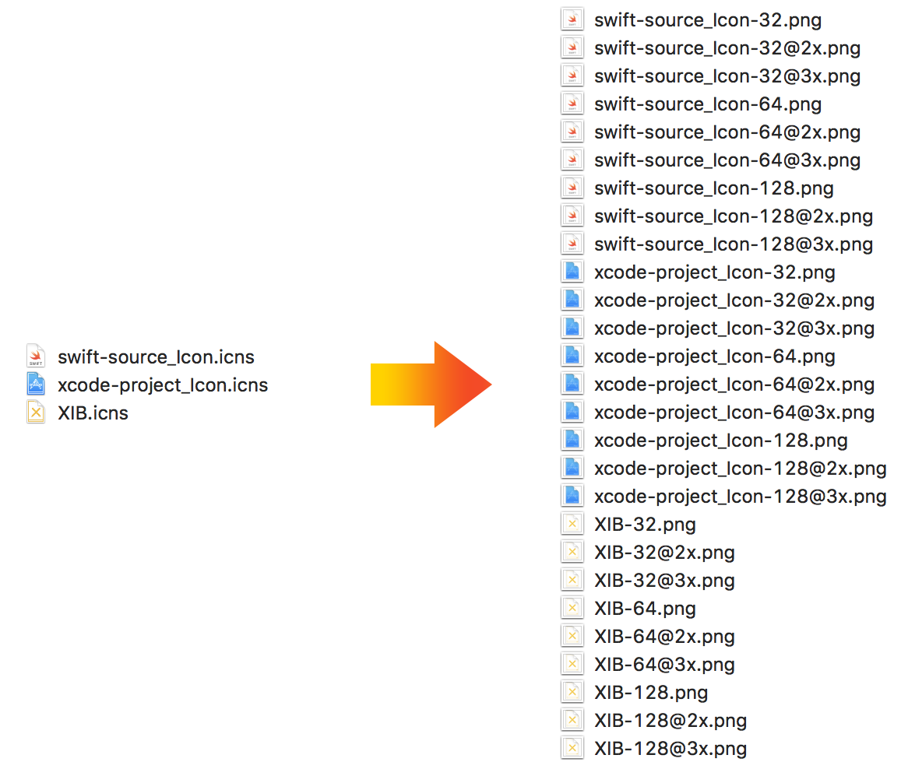

# icns2png

This is a Swift command line script that converts .icns files to .png files at various sizes. The main usage for this is to convert .icns assets that are used in a Mac app that you want to bring to iOS.

## Usage
```bash
swift icns2png.swift
```

The current implementation expects an "icns" input folder and "png" output folder. 

